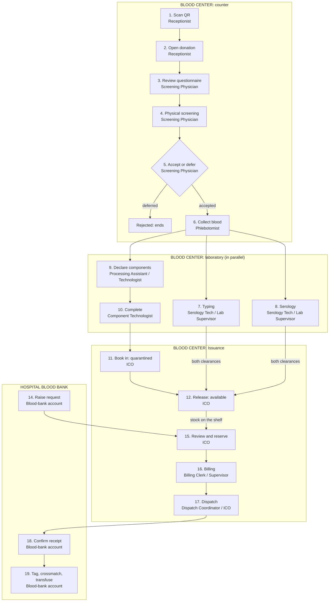

# RedAgos Operational Lifecycle: Who Does What, in Order

A step-by-step guide to the whole internal process, from the donor's QR code being scanned at the Blood Center counter to the hospital Blood Bank transfusing the bag. For every step it says **which role logs in**, **what they do**, **what the system records**, **what must be approved or already true**, and **who picks it up next**.

## 0. Scope and before you start

**In scope:** what staff do, on both portals, from the QR scan onward: the Blood Center's five departments and its Center Admin, and the Hospital Blood Bank's accounts.

**Out of scope:** what donors do themselves: registering, booking, answering the health questionnaire, receiving a QR code, the donor portal, and the notifications donors get.

**Sources:** every role, ability, status and refusal below comes from the code (`app/Support/DepartmentPermissions.php`, `app/Enums/`, `app/Service/`) and the decision log, [`IMPLEMENTATION_DECISIONS.md`](IMPLEMENTATION_DECISIONS.md). Department detail is in [`BLOOD-CENTER.md`](BLOOD-CENTER.md); the hospital shelf's tagging rules are in [`hospital-blood-bank-inventory-rules.md`](hospital-blood-bank-inventory-rules.md). If this guide and the code disagree, the code is right; please correct this file.

**Staff accounts already exist, but three things must be true for the flow to work:**

1. **Each component has a shelf life** (Center Admin → Blood Components). The Stock Intake screen only offers a component that has one (Step 11).
2. **The Blood Bank has saved its request days** for each center it orders from (Weekly Request page). A weekly request can only be sent on those days (Step 14).
3. **The scheduler is running** (`php artisan schedule:work` locally, cron in production). Without it, expired bags keep saying `available`, lapsed tags keep holding bags, and no low-stock notification is sent (see §5.3).

> **Clinical sign-off is still outstanding** for the quarantine-and-release rules (Step 12). The rules are the project owner's decision; confirmation from the capstone adviser or the partner blood center has not been recorded.

---

## 1. The process at a glance

| # | Process | Who does it (role and login email) | Result in the system | Next |
|---|---|---|---|---|
| | **Collection** (front desk and counter) | **Head (approves change requests):**<br>Donor Screening Physician<br>`screening.physician@redagos.test` | | |
| 1 | **Scan the QR** (check in) | **Medical Receptionist**<br>`medical.receptionist@redagos.test` | Donor identified; appointment `scheduled` → `confirmed` | 2 |
| 2 | **Open the donation** | **Medical Receptionist**<br>`medical.receptionist@redagos.test` | Donation `registered` | 3 |
| 3 | **Screening: review the questionnaire** | **Donor Screening Physician**<br>`screening.physician@redagos.test` | Answers read; officer's margin notes entered | 4 |
| 4 | **Physical screening** | **Donor Screening Physician**<br>`screening.physician@redagos.test` | Vitals and the physical exam recorded | 5 |
| 5 | **Accept or defer** | **Donor Screening Physician**<br>`screening.physician@redagos.test` | `screening` (accepted) or `rejected` (deferred; ends here) | 6 |
| 6 | **Collect the blood** | **Phlebotomist**<br>`phlebotomist@redagos.test`<br>or **Apheresis Specialist**<br>`apheresis.specialist@redagos.test` | Donation `collected`, with its barcode sticker | 7 and 9, together |
| | **Testing** (starts together with Processing) | **Head (approves change requests):**<br>Laboratory Supervisor<br>`lab.supervisor@redagos.test` | | |
| 7 | **Testing: blood typing** | **Serology Technologist**<br>`serology.technologist@redagos.test`<br>or **Laboratory Supervisor**<br>`lab.supervisor@redagos.test` | Immunohematology clearance token | 12 |
| 8 | **Testing: serology (TTI)** | **Serology Technologist**<br>`serology.technologist@redagos.test`<br>or **Laboratory Supervisor**<br>`lab.supervisor@redagos.test` | TTI clearance token, or `rejected` + counselling referral | 12 |
| | **Processing** (starts together with Testing) | **Head (approves change requests):**<br>Component Technologist<br>`component.technologist@redagos.test` | | |
| 9 | **Processing: declare components, print base labels** | **Processing Assistant**<br>`processing.assistant@redagos.test`<br>or **Component Technologist**<br>`component.technologist@redagos.test` | Bags and volumes declared | 10 |
| 10 | **Processing: complete** | **Component Technologist**<br>`component.technologist@redagos.test` | Donation `completed` (bags handed to Issuance) | 11 |
| | **Issuance** (stock) | **Head (approves change requests):**<br>Inventory Control Officer (ICO)<br>`inventory.control.officer@redagos.test` | | |
| 11 | **Book in** (Stock Intake) | **ICO**<br>`inventory.control.officer@redagos.test` | Bags `quarantined` | 12 |
| 12 | **Release from quarantine** | **ICO**<br>`inventory.control.officer@redagos.test` | Bags `available`; final labels printed | 13, 15 |
| 13 | **Shelf monitoring** (continuous) | **ICO**<br>`inventory.control.officer@redagos.test`<br>**Dispatch Coordinator** (view)<br>`dispatch.coordinator@redagos.test`<br>**IT Data Entry Clerk** (view, audit)<br>`it.data.clerk@redagos.test`<br>**Center Admin**<br>`supervisor@redagos.test` | Minimums watched; expired bags found | 15 |
| | **Hospital Blood Bank** (no departments, so no head) | Every account does every action | | |
| 14 | **Raise a request** | **Any blood-bank account**<br>`user@redagos.ph` (SPMC Blood Bank) | Request `pending` at the center | 15 |
| | **Issuance** (requests) | **Head (approves change requests):**<br>ICO<br>`inventory.control.officer@redagos.test` | | |
| 15 | **Review and reserve** | **ICO**<br>`inventory.control.officer@redagos.test`<br>Reject only: **ICO** or **Dispatch Coordinator**<br>`dispatch.coordinator@redagos.test` | Bags `reserved`; billing statement raised | 16 |
| | **Billing** | **Head (approves change requests):**<br>Billing Supervisor<br>`billing.supervisor@redagos.test` | | |
| 16 | **Billing** | **Billing Clerk**<br>`billing.clerk@redagos.test`<br>or **Billing Supervisor**<br>`billing.supervisor@redagos.test` | Statement `paid` or `subsidised` | 17 |
| | **Issuance** (dispatch) | **Head (approves change requests):**<br>ICO<br>`inventory.control.officer@redagos.test` | | |
| 17 | **Dispatch** | **Dispatch Coordinator**<br>`dispatch.coordinator@redagos.test`<br>or **ICO**<br>`inventory.control.officer@redagos.test` | Bags `issued`; request Partially Fulfilled / Fulfilled | 18 |
| | **Hospital Blood Bank** (no departments, so no head) | Every account does every action | | |
| 18 | **Confirm receipt** | **Any blood-bank account**<br>`user@redagos.ph` | Bags enter the hospital's stock as `available` | 19 |
| 19 | **Tag, crossmatch, transfuse** | **Any blood-bank account**<br>`user@redagos.ph` | `tag_assigned` → `tag_crossmatched` → `transfused` | End |

**About the heads and the emails.**

- **Heads.** A department's head approves its *change requests* (corrections to records already saved; see §5.1). Nobody decides their own request, so when a **head** files one it goes to the **Center Admin** (`supervisor@redagos.test`). A hospital blood bank has no departments and no change-request approval.
- **Emails.** The addresses are the demo accounts that `BloodCenterStaffSeeder` creates for Sub-National Blood Center, plus the SPMC Blood Bank account in the local database. They exist only on local and test setups. On any other deployment, use the real account for each role. Passwords are deliberately not listed here.

**The order of Testing and Processing.** Steps 7–8 (Testing) and 9–10 (Processing) start the moment the donation is `collected`, and neither waits for the other. Processing does *not* wait for test results, because plasma has to be frozen within hours of the draw. The two meet at **Step 12**: a bag cannot leave quarantine until Processing has handed it over (Step 11 needs a `completed` donation) *and* Testing has issued both clearance tokens. Steps 7 and 8 can also be done in either order, by two people.



---

## 2. Who logs in where

| Role | Portal | Department | Lands on | Steps they perform |
|---|---|---|---|---|
| Donor Care / **Medical Receptionist** | Blood Center | Collection | Appointments | 1, 2 |
| **Donor Screening Physician** | Blood Center | Collection | Collection | 3, 4, 5 (and may re-scan at 1) |
| **Phlebotomist / Registered Nurse**, **Apheresis Specialist** | Blood Center | Collection | Collection | 6 |
| **Processing Laboratory Assistant** | Blood Center | Processing | Processing | 9 |
| **Component Laboratory Medical Technologist** | Blood Center | Processing | Processing | 9, 10 |
| **Serology / Molecular Medical Technologist** | Blood Center | Testing | Testing | 7, 8 |
| **Laboratory Supervisor** | Blood Center | Testing | Testing | 7, 8, counselling referrals |
| **Inventory Control Officer (ICO)** | Blood Center | Issuance | Issuance | 11, 12, 13, 15, 17 |
| **Dispatch / Transport Coordinator** | Blood Center | Issuance | Request Fulfillment | 13 (view), 15 (reject, return holds or close a line; cannot reserve), 17 |
| **IT Data Entry Clerk** | Blood Center | Issuance | Blood Inventory | 13 (audit, view only) |
| **Billing Clerk**, **Billing Supervisor** | Blood Center | Billing | Billing & Payments | 16 |
| **Center Admin** | Blood Center | none (a supervisor) | Center Overview | Any step; plus the approvals in §5.1 |
| **Blood-bank account** | Hospital Blood Bank | none | Dashboard | 14, 18, 19 |

- **A role is a fixed post.** It decides the department and exactly what the person may do. A custom typed role inherits only its department's abilities, never `corrections.approve`, `inventory.audit` or `inventory.thresholds`.
- **The Center Admin holds every ability** but is bound by the same hard rules as everyone else (§5.2). It is the fallback approver when a department head files their own correction.
- **A hospital blood bank has no departments or abilities.** Any account at the same hospital can do everything the Blood Bank does.
- **Facility isolation.** A user only ever sees their own facility's stock and requests; the facility comes from the login, never from what a page sends. Email must be verified and the facility approved before either portal lets an account operate.

---

## 3. Blood Center: front desk to laboratory

### Step 1. Scan the QR (check in)

| | |
|---|---|
| **Log in as** | **Medical Receptionist**, on the front desk (Appointments / Collection page). The Donor Screening Physician, Phlebotomist and Apheresis Specialist can also scan (`appointments.verify`), which is how the person in the chair is re-confirmed before the draw. |
| **Actions** | Scans the donor's QR code. The system hashes the code and matches it. **Presenting the QR is the check-in.** The screen shows who is at the counter, today's appointment, any donation already open, a reference to the donor's questionnaire, and a **prior-deferral banner** if the donor has a permanent or indefinite deferral on record (outcome and date only, never the reason). |
| **If there is no usable QR** | The code is refused as one message (`qr_invalid`: "Ask for an ID instead") whether it never existed, expired or was revoked. The Receptionist looks the donor up by **valid ID** instead (PhilSys, UMID, driver's license, passport, postal, PRC, voter's or SSS ID), which shows the same deferral banner. A donor with no record is registered by the Receptionist (`donors.manage`). A donor who never arrives is marked **no-show**. |
| **Status changes** | Appointment `scheduled` → `confirmed` (arrived). Each scan and rejected scan is audited. |
| **Approvals** | None. A deferral banner **blocks nothing**: the physician decides at Step 5. |
| **Hands off to** | Step 2 (same Receptionist). |

### Step 2. Open the donation

| | |
|---|---|
| **Log in as** | **Medical Receptionist** (`donations.register`) |
| **Actions** | Opens the visit's donation record for the donor who is present, linked to their appointment. |
| **Status changes** | Donation created as **`registered`**. Only one donation can be open per donor at a facility (`donation_already_open`), so a second click at a busy counter cannot create a phantom bag. |
| **Approvals** | None. |
| **Hands off to** | **Donor Screening Physician** (Step 3). The donation appears as in progress on the Collection page. |

A visit that cannot go ahead can be closed by the Receptionist, the Physician or the Phlebotomist/Apheresis Specialist (`donations.close`).

### Step 3. Screening: review the questionnaire

| | |
|---|---|
| **Log in as** | **Donor Screening Physician** (Collection page). No other staff role can open the questionnaire (`donors.view_questionnaire`); the Center Admin can, as it holds every ability. |
| **Actions** | Opens the questionnaire drawer and reads the donor's declared answers: Section I-A (personal data), I-B (29 history questions), I-C (informed consent). Rows with a review flag are highlighted so the eye lands on them; **a flag is a prompt to look, never a deferral trigger**. The drawer says if the donor answered an older form version. The physician also fills the officer's four **margin boxes** at the top of the drawer: Sleep, Meal, Meds, Allergies, asked in person and transcribed (never pre-filled from the donor's own answers). The physician may open the donor's history (`donors.view_clinical`): earlier deferral reasons and the final lab result, never an individual marker. |
| **Status changes** | None yet. The questionnaire is **read-only** (the margin boxes save with the screening at Step 4). Each read is rate-limited and audited. |
| **Approvals** | The donor's answers decide nothing by themselves; the physician's judgement is the verdict. |
| **Hands off to** | Step 4 (same physician). |

### Step 4. Physical screening

| | |
|---|---|
| **Log in as** | **Donor Screening Physician** (`donations.screen`) |
| **Actions** | Records the vitals: blood pressure (systolic/diastolic), pulse, temperature, weight, **haemoglobin**, and an optional **fingerprick blood type** (preliminary; it never fills the donor profile and never pre-fills the lab's typing). Records Section I-D as observed: **general appearance, skin, HEENT, heart and lungs**, plus free-text notes. |
| **Status changes** | Saved together with Step 5 as **one screening record**. The physician is recorded as the screening officer (`recorded_by`, taken from the login, never typed). |
| **Approvals** | No vital or haemoglobin value defers anyone automatically; the ranges are typing guards, not clinical thresholds. |
| **Hands off to** | Step 5 (same screen, same physician). |

### Step 5. Accept or defer

| | |
|---|---|
| **Log in as** | **Donor Screening Physician**. Nobody else at the counter may clear a donor. |
| **Actions** | Chooses one outcome: **accepted**, **temporarily deferred**, **permanently deferred** or **indefinite deferral**. A reason is required for any deferral. |
| **Status changes** | **Accepted:** donation `registered` → **`screening`**. **Any deferral:** donation → **`rejected`** with the reason recorded; the appointment is closed and the donor is sent home. A permanent or indefinite deferral is shown to the next counter as the Step 1 banner. |
| **Approvals** | A saved screening is **never overwritten** (`correction_required`). The physician files a correction; because the physician *is* Collection's approver, a physician's own screening correction goes to the **Center Admin**. |
| **Hands off to** | **Phlebotomist / Apheresis Specialist** (Step 6) if accepted. A deferral ends the process for this donation. |

### Step 6. Collect the blood

| | |
|---|---|
| **Log in as** | **Phlebotomist / Registered Nurse** or **Apheresis Specialist** (Collection page, `donations.collect`) |
| **Actions** | Confirms who is in the chair, then records the **collection box**: bag type (single, double, triple), the **donation barcode sticker** (scanned or typed; letters, digits and hyphens, up to 30 characters), start and end times, and volume in mL. |
| **Status changes** | Donation `screening` → **`collected`**. The collecting staff member is recorded from the login. The barcode must be unique at the facility. |
| **Approvals** | Refused unless the donation is `screening` **and** a screening record exists (`donation_not_screened`). A phlebotomist cannot alter the screening or clear a deferred donor. A collection-box correction is filed by the phlebotomist and approved by the **Donor Screening Physician**; it is refused once any bag is booked against the donation. |
| **Hands off to** | **Testing** (Steps 7–8) and **Processing** (Steps 9–10), starting together. From here on, the laboratory works by **barcode**, blind to the donor's identity. |

### Step 7. Testing: blood typing (immunohematology)

| | |
|---|---|
| **Log in as** | **Serology / Molecular Medical Technologist** or **Laboratory Supervisor** (Testing page; both roles hold both Testing cards) |
| **Actions** | Finds the donation by barcode and records the forward group, reverse group, antibody screen and the ABO/Rh typing. |
| **Status changes** | **Concordant** (forward = reverse, antibody screen negative): the **immunohematology clearance token** is issued at once and the donor profile adopts the blood type. **Discrepant or antibody-positive:** the typing is saved but **held** (`clearance_hold`). A typing that contradicts a blood type already on the donor profile is refused (`blood_type_mismatch`). |
| **Approvals** | A cleared typing is final. A held typing changes only through a correction the **Laboratory Supervisor** decides. A cleared result can be corrected only while none of the donation's bags has left quarantine. |
| **Hands off to** | Step 12, which needs this token. |

### Step 8. Testing: serology (TTI)

| | |
|---|---|
| **Log in as** | **Serology / Molecular Medical Technologist** or **Laboratory Supervisor** (Testing page) |
| **Actions** | Records the five-marker panel: **HIV, HBsAg, HCV, Syphilis, Malaria**, each reactive or non-reactive. All five are required. |
| **Status changes** | **All non-reactive:** the **TTI clearance token** is issued at once. **Both tokens in while the donation is still `collected`:** donation → **`tested`**. **Any marker reactive:** in the same transaction the donation is **`rejected`**, any bags already booked stay locked in quarantine, the donor is permanently deferred, and a **counselling referral** is opened. |
| **Approvals** | A reactive panel only saves with an explicit `confirm_reactive`. A reactive result **can never be changed, deleted or corrected**. Which marker was reactive is visible only to the Testing department and the referral list. |
| **Hands off to** | Step 12 if cleared. If reactive, the **Laboratory Supervisor** alone works the referral list (`pending` → `contacted` → `referred` → `closed`; a step may be skipped; closing needs a note). The bags can only be discarded. |

### Step 9. Processing: declare components and print base labels

| | |
|---|---|
| **Log in as** | **Processing Laboratory Assistant** or **Component Laboratory Medical Technologist** (Processing page) |
| **Actions** | Finds the donation by barcode. **Declares the component breakdown**: one row per physical bag, with its volume in mL. Prints the **base (Phase 1) label** for each numbered bag. |
| **Status changes** | Bags are numbered `{barcode}-{CODE}`: `1234567-PRBC`, `1234567-FFP`, a second bag of a component `1234567-PRBC-2`. The label shows bag number, component, volume, barcode and "QUARANTINE: NOT FOR ISSUE". It carries **no blood type and no clearance**. |
| **Approvals** | A saved breakdown is corrected the same way as any record (Step 10's technologist approves; §5.1). |
| **Hands off to** | Step 10. |

### Step 10. Processing: complete

| | |
|---|---|
| **Log in as** | **Component Laboratory Medical Technologist** only (`lab.update_status`). The assistant cannot complete or reject. |
| **Actions** | Marks the donation **complete**, which hands the bags to Issuance, or **rejects** it for any other reason. |
| **Status changes** | Donation `collected` (or `tested`) → **`completed`**. It does **not** mean "cleared for issue"; it means "processed, bags handed over". Refused unless the donation is `collected` or `tested` and has at least one declared component (`components_missing`). A donation that reaches `completed` first stays `completed` when its tokens arrive. |
| **Approvals** | The technologist is **Processing's correction approver**; their own correction goes to the Center Admin. |
| **Hands off to** | **Issuance**: the Inventory Control Officer (Step 11). |

---

## 4. Blood Center Issuance, then the hospital

### Step 11. Book in (Stock Intake)

| | |
|---|---|
| **Log in as** | **Inventory Control Officer** (Stock Intake page, `inventory.create`) |
| **Actions** | Scans or types the donation barcode and books in each declared bag under its number, with **storage location** and **expiry date**. The screen offers only components that have a shelf life and pre-fills the expiry as donation date + shelf life; the bag's own printed date may override it. The blood type comes from the donation, never from what is typed. |
| **Status changes** | Bags are created **`quarantined`**, always, even if testing has already finished. |
| **Approvals** | The server refuses a component Processing did not declare, more bags than were declared (`exceeds_declared_quantity`), an expiry date that has already passed, and a bag number already in use (`bag_number_taken`). Intake needs the donation `completed`. |
| **Hands off to** | Step 12. The bags wait in quarantine. |

### Step 12. Release from quarantine

| | |
|---|---|
| **Log in as** | **Inventory Control Officer** (Stock Intake page). The only role holding `inventory.release_quarantine`, besides the Center Admin. |
| **Actions** | Releases a donation's bags and prints their **final (Phase 2) labels**, which are affixed before the bags go on the ready-for-issue shelf. |
| **Status changes** | Bags `quarantined` → **`available`**. Each bag records when it was released and by whom. |
| **Approvals** | Refused unless **both** clearance tokens exist, the donation was **not rejected**, and **no bag is past its expiry** (all or nothing per donation: discard the expired bag first). The Center Admin is bound by the same rules. |
| **Hands off to** | The shelf (Step 13), then Step 15 when a request arrives. |

The final label shows the verified blood type (large), component, volume, expiry, bag number, each clearance code (`TTI-…`, `IH-…`) with who cleared it and when, and who released the bag and when. It never shows the donor. Labels can be reprinted from Blood Inventory.

### Step 13. Shelf monitoring (continuous)

| | |
|---|---|
| **Log in as** | Anyone with `inventory.view`: **ICO**, **Dispatch Coordinator**, **IT Data Entry Clerk**, **Component Technologist**, **Laboratory Supervisor**, **Center Admin**. Setting minimums takes `inventory.thresholds`: the **ICO** or the **Center Admin**. |
| **Actions** | **Blood Inventory:** stock in first-expiry-first-out order, near-expiry counts. **Stock Thresholds:** a **minimum per blood type and component**; everyone with inventory access sees stock against it. **Daily Stock Report** (ICO): the signed PDF stock sheet. **Discard** (ICO): expired or damaged bags. **IT Data Entry Clerk:** audits records against scanned barcodes and files corrections; cannot change anything directly. |
| **Status changes** | The nightly sweep (00:30, Asia/Manila) moves `available` bags past their date to **`expired`**; an expired bag can then be `discarded`. A stock is `ok` at or above its minimum, `low` below it, `critical` when empty under a minimum. A **red banner** shows on the inventory pages, and **one low-stock notification per low episode** goes to every account holding `inventory.view`. |
| **Approvals** | The **ICO edits a unit's storage location and expiry directly**. Everyone else files a correction for the ICO. |
| **Hands off to** | Step 15 when a request arrives. A shortage is the cue to chase supply. |

Only `available` bags that are **not past their date** count as stock. Quarantined, reserved, issued, expired and discarded bags never do.

### Step 14. Raise a request (Hospital Blood Bank)

| | |
|---|---|
| **Log in as** | **Any blood-bank account** |
| **Actions** | Chooses one of two routes. |

**14a. Weekly Request (restock the shelf).** Weekly Request page, sent only on a **request day** saved in "Before you start".

- The form is lines of component, blood type and units. It has no patient and no indication.
- One weekly request creates **one routine replenishment request** covering every blood type and component on it, numbered `RQ-…` under a `WR-…` reference. Each line names its own blood type, and the center reviews and dispatches the whole order at once.
- Refused with `no_request_schedule` (no schedule for that center), `not_a_request_day`, or `weekly_request_exists` (already sent for that day).
- A line's requested quantity never changes. What the center supplied, what the hospital received and what was closed short are tracked separately.

**14b. Patient Transfusion Request (a named patient's need).** Blood Requests → New Request.

- Staff enter the patient (surname, first name, age, sex), each component with its **indication code** (required for the components the DOH form prints codes for), and the urgency (**Routine** or **STAT**), and **confirm the hospital's own stock cannot cover the patient** (`internal_stock_confirmed`).
- **Sourcing advice** lists centers holding matching issuable stock, earliest expiry first. It is advice only and holds nothing.
- The need is recorded once as a `PTR-…` requirement and **split into Facility Allocations**, one per center asked, each an `RQ-…` request the center works normally. Asking for more than is unallocated is refused.
- The hospital can add allocations, **withdraw** one nobody has answered, **close** a component the patient no longer needs, and **cancel** (only while nothing is reserved or released).

| | |
|---|---|
| **Status changes** | A request starts **`pending`**. A PTR's overall status is derived: Pending → Processing (anything approved) → Partial (anything released) → Fulfilled; Cancelled is the only explicit state. |
| **Approvals** | None at the hospital. The center decides (Step 15). |
| **Hands off to** | The target center's **Issuance** department. Staff holding `requests.approve` or `requests.process`, and supervisors, are notified. |

*Walk-in variant:* when a watcher brings a patient's request to the center in person, the **ICO** or **Dispatch Coordinator** (`requests.record`) phones the hospital blood bank first and records the request **only once the hospital confirms**. It becomes the hospital's own request and carries on at Step 15.

### Step 15. Review and reserve (Blood Center)

| | |
|---|---|
| **Log in as** | **Inventory Control Officer** to approve and reserve (Incoming Requests page). The **ICO or Dispatch Coordinator** may reject, return holds, or close a line. |
| **Actions** | **Approve & Reserve** (`requests.process`, ICO only): holds issuable units for the request in **first-expiry-first-out** order, never more than the request still needs or the shelf has; partial cover is allowed. **Reject** (`requests.approve`): a reason is required (at least 3 characters). **Return holds** to stock. **Close a line** the center cannot supply (`unavailable`). |
| **Status changes** | Units `available` → **`reserved`**; each hold is an allocation `allocated`. Approval and reservation are one operation, so the request moves `pending` → `processing`, and a **billing statement is raised or updated** in the same step. A rejection records its reason and notifies the requester. |
| **Approvals** | Quarantined and past-date units are never offered. If nothing matches the answer is `no_matching_stock`. |
| **Hands off to** | **Billing** (Step 16), then **Dispatch** (Step 17). The hospital is notified of an approval or rejection. |

### Step 16. Billing

| | |
|---|---|
| **Log in as** | **Billing Clerk** or **Billing Supervisor** (Billing & Payments page) |
| **Actions** | Reads the statement raised at reservation (priced at the *fulfilling center's own* component prices). **Records payments** (Cash, or GCash with its provider reference; no gateway is configured, so billing staff enter the reference). Or **applies the government subsidy**, which writes the balance to zero. |
| **Status changes** | Statement `unpaid` → `partial` → `paid`, or `subsidised`, or `void`. **Paid and Subsidised both clear the request for release.** Today components carry no price, so statements come to zero and are settled on creation, and the gate passes without anyone acting. |
| **Approvals** | The **Billing Supervisor** approves payment corrections (amount, method, reference). A clerk's correction goes to the supervisor; a supervisor's own goes to the **Center Admin**. A correction approved *after* dispatch can reopen a balance: the units stay released and the statement shows as outstanding. |
| **Hands off to** | **Dispatch** (Step 17). Release is refused with `billing_unsettled` (or `billing_missing`) until the statement clears. |

### Step 17. Dispatch

| | |
|---|---|
| **Log in as** | **Dispatch / Transport Coordinator** or **ICO** (Request Fulfillment page, `requests.release`) |
| **Actions** | Selects the reserved units and **releases** them for transport, recording who physically took them (`handed_to`; for a walk-in, the watcher). |
| **Status changes** | Units `reserved` → **`issued`**. Allocations `allocated` → **`released`**. The request becomes **Partially Fulfilled** or **Fulfilled**: fulfillment is counted **at dispatch**, not at receipt. For a *weekly* request, any unsupplied remainder is closed automatically as unavailable ("Not supplied in this weekly delivery."). |
| **Approvals** | Three checks, in order: the **billing statement clears**; **every unit has both clearance tokens** (`unit_not_cleared` otherwise); a weekly request goes out in **one delivery** (`weekly_release_all`). A correction to *when a unit left* or *who took it* is filed by the Dispatch Coordinator or ICO and approved by the **ICO** (the ICO's own goes to the Center Admin). It never changes status or receipt. |
| **Hands off to** | The **Hospital Blood Bank** (Step 18). The requester is notified that units were released. |

---

## 5. Hospital Blood Bank, and the rules that cut across

### Step 18. Confirm receipt

| | |
|---|---|
| **Log in as** | **Any blood-bank account** (the request's page; or, for a weekly delivery, the Weekly Request page) |
| **Actions** | Confirms receipt of the dispatched units. For a weekly delivery, **scans or types the bag numbers**; they are matched against that delivery's dispatched, unreceived bags. |
| **Status changes** | Receipt is stamped per unit, and **in the same transaction each received bag enters the hospital's own stock as `available`**. The center's side stays `issued`. Receipt does **not** change the request's status; the page reports "received x of y". |
| **Approvals** | **Only the hospital can confirm arrival.** The dispatching center cannot assert it. |
| **Hands off to** | The Blood Bank shelf (Step 19). |

**Alternative entry: Direct Distribution** (blood from outside RedAgos, for example the Philippine Red Cross). A blood-bank account books each bag in on the Direct Distribution page: external source, the **sender's own bag number** (RedAgos prints none), blood type, component, volume, expiry, and either the PTR it is for or who requested it. The bag goes straight to `available`. Bags from outside have no storage location and no clearance tokens; RedAgos records what the sender's label says and does not re-test it.

### Step 19. Tag, crossmatch, transfuse

| | |
|---|---|
| **Log in as** | **Any blood-bank account** (Blood Bank Inventory page) |
| **Actions** | **Tag** a specific bag for a named patient (surname, first name, age and sex required; an optional PTR). **Crossmatch** it (records a completed, compatible crossmatch). **Transfuse** it. Or **release** the tag early (reason required), **confirm a bag back** into storage, or **discard** it (reason required). |
| **Status changes** | See the diagram below. |
| **Approvals** | None: every blood-bank account may do every action. Each transition is audited, and patient names stay out of the audit log. |
| **Hands off to** | The end of the unit's life: **transfused** or **discarded**. Transfusion does not change a PTR's status, billing or reports. |

```
 available ──tag──► TAG ASSIGNED ──crossmatch──► TAG CROSSMATCHED ──transfuse──► transfused
                    (24 h to crossmatch)         (24 h to transfuse)
     ▲                    │ deadline / release          │ deadline / release
     │                    ▼                             ▼
     └──────────── back to available            pending_return ──return──► available
                                                        └──discard──► discarded
 available ──(past its date, nightly)──► expired ──discard──► discarded
```

- The **24-hour deadlines** are exact: a tag placed at 08:00 can be crossmatched until 07:59:59 the next day. From the deadline, crossmatch and transfusion are refused (`tag_deadline_passed`), and a sweep running every minute ends the tag.
- A **Tag Assigned** bag never left storage, so when its tag ends it returns to `available`. A **Tag Crossmatched** bag has left storage, so it becomes `pending_return` until staff confirm it is back or discard it.
- Tagging does **not** block on a blood-type mismatch; the screen warns and the crossmatch is the clinical check. A bag past its date cannot be tagged, crossmatched or transfused (`bag_expired`).
- The blood bank also has **Stock Thresholds**: it sets its own minimum per blood type and component, sees a red banner when below, and **every account** at the hospital gets one notification per low episode.

---

### 5.1 Corrections: who approves what

A saved record is never overwritten. The person whose role wrote it files a **correction request** with the corrected values and a reason; the department head approves or rejects it. **Nobody decides their own request**, and a head's own request goes to the **Center Admin**.

| Department | Head (approver) | Records that can be corrected |
|---|---|---|
| Collection | Donor Screening Physician | Screening, collection box |
| Processing | Component Laboratory Medical Technologist | Component breakdown |
| Testing | Laboratory Supervisor | Immunohematology typing, serology panel |
| Issuance | Inventory Control Officer | A unit's details (storage location, expiry), dispatch records |
| Billing | Billing Supervisor | A recorded payment |

- A **reactive serology result can never be corrected.**
- A **cleared** result can be corrected only while none of the donation's bags has left quarantine (`units_released`).
- A correction **never changes where a unit or allocation stands in the workflow**. It cannot move a bag and it cannot assert receipt.
- Who may *file* an Issuance or Billing correction is decided by the post: unit details by the IT Data Entry Clerk, dispatch records by the Dispatch Coordinator or ICO, payments by the Billing Clerk or Supervisor, and any of them by the Center Admin.

### 5.2 Hard rules (enforced in code; the Center Admin is bound too)

1. A reactive serology result can never be changed, deleted or corrected.
2. A unit leaves quarantine only with **both** clearance tokens, from a donation that was not rejected.
3. Clearance tokens are never edited or deleted; one is only ever revoked, once, by an approved correction.
4. Editing a unit never moves it out of quarantine.
5. Nothing is **dispatched** whose donation lacks either clearance.
6. Laboratory and inventory screens never show a donor's name to a role that does not meet donors.
7. Receipt is the hospital's alone.
8. No unit is released without a cleared billing statement. (The one documented exception: a payment correction approved *after* dispatch can reopen a balance.)

### 5.3 Notifications and scheduled jobs

| Event | Notified |
|---|---|
| New blood request submitted | Center staff holding `requests.approve` or `requests.process`, and supervisors |
| Request approved, rejected or released | The requesting hospital account (all its accounts for a walk-in) |
| Walk-in request recorded | All accounts of the hospital it was recorded for |
| Stock below its minimum | Center: accounts holding `inventory.view`. Blood bank: all its accounts |

| Job | When | What it does |
|---|---|---|
| `inventory:expire-units` | Daily 00:30 (Asia/Manila) | Center `available` bags past their date → `expired` |
| `hospital:expire-units` | Daily 00:30 (Asia/Manila) | Hospital `available` bags past their date → `expired` |
| `hospital:expire-tags` | Every minute | Ends tags past their 24-hour deadline |
| `inventory:check-thresholds` | Every minute | Sends low-stock notifications, once per low episode |

---

## 6. Status reference

**Appointment** (`donation_appointments.status`): `scheduled` → `confirmed` (arrived); `completed`, `cancelled`, `no_show`.

**Donation** (`donations.status`): `registered` → `screening` → `collected` → `tested` → `completed`; `rejected` from the counter (deferral), from Testing (reactive) or from Processing.

**Screening outcome:** `accepted`, `temporarily_deferred`, `permanently_deferred`, `indefinite_deferral`.

**Center blood unit** (`blood_units.status`): `quarantined` → `available` → `reserved` → `issued`; `available` → `expired` → `discarded`; `discarded` from other states by the ICO.

**Allocation** (`request_allocations.status`): `allocated` ("Reserved") → `released`; `cancelled` when a hold is returned to stock.

**Blood request** (`blood_requests.status`): `pending` → `processing` → `partial` → `fulfilled`; `rejected` and `cancelled`. Derived from the lines, never set by hand.

**Billing statement** (`billings.status`): `unpaid` → `partial` → `paid`; `subsidised`; `void`.

**Hospital unit** (`hospital_units.status`): `available`, `tag_assigned`, `tag_crossmatched`, `pending_return`, `transfused`, `expired`, `discarded`.

**Tag** (`unit_tags.status`): `tag_assigned` → `tag_crossmatched` → `transfused`; or `untagged_assigned` / `untagged_crossmatched` with a reason (`crossmatch_deadline_expired`, `transfusion_deadline_expired`, `released_by_staff`).

**Stock level** (derived per blood type and component): `unmonitored`, `ok`, `low`, `critical`.

---

## 7. Known gaps

These are recorded in the decision log; they are listed here so nobody assumes otherwise.

- **Clinical sign-off** of the quarantine-and-release rules has not been obtained.
- **Quality control before dispatch** is not a step. The fulfillment screen tracks `allocated → released → received` only.
- **The hospital cannot see its own billing statement.** It learns what was charged, or that the subsidy covered it, only by being told.
- **A mis-keyed reactive result cannot be undone in the app.**
- **There is no MOA or partner relationship** between a hospital and a center in the schema; a request may be addressed to any approved center.
- **The handover half of the DOH request form** (type of crossmatching, donors provided, received-by and extracted-by signatures) is printed blank and filled in on paper.
- **A permanent or indefinite deferral gates nothing.** It is shown as a banner and the physician decides.
- **Blood bank tag lapses send no notification;** the on-screen countdown is the signal.
- **Low-stock notifications arrive up to about a minute late,** and are in-app only (no email).
